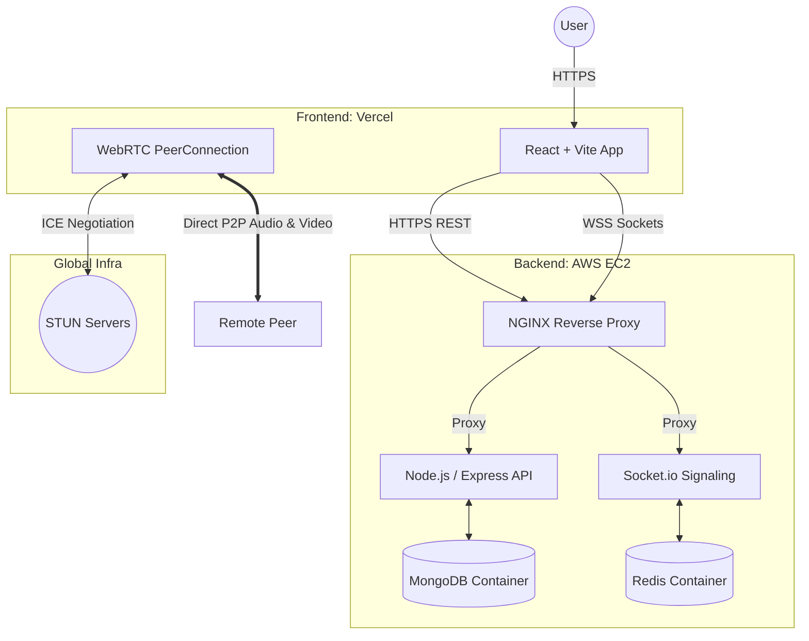

<div align="center">
  
  
  # Meetix 📹💬

  **Real-Time P2P Video Chat & Messaging Platform**

  [](https://github.com/subhadipm08/meetix/actions)
  [](https://meetixchat.vercel.app/)
  [](https://opensource.org/licenses/MIT)

  [**View Live Website**](https://meetixchat.vercel.app/) • [**Report Bug**](https://github.com/subhadipm08/meetix/issues) • [**Request Feature**](https://github.com/subhadipm08/meetix/issues)
</div>

---

Meetix is a modern, WebRTC-powered platform designed for real-time video calls and instant messaging with users worldwide. Leveraging direct peer-to-peer (P2P) connections, Meetix provides a seamless, low-latency communication experience directly within your web browser.

> [!WARNING]
> **Security & Privacy Note:** This application uses public **STUN servers** to facilitate WebRTC connection negotiation. STUN servers share your public IP address with the matching peer to establish a direct peer-to-peer media stream. For production environments, hosting and using **TURN servers** is highly recommended to relay traffic and fully mask client IP addresses.

---

## ✨ Features

- **🎥 Live P2P Video Calls:** Ultra-low latency video and audio communication powered by the WebRTC API.
- **💬 Real-Time Chatting:** Integrated text messaging interface to chat alongside your video session.
- **🔄 Random Matchmaking:** Intelligent signaling flow that pairs active users automatically.
- **🔒 Secure Connections:** End-to-end media encryption and JWT-based REST authentication.
- **🛡️ Email Verification:** Secure OTP email verification system for new user registrations.
- **🎨 Modern Premium UI:** Beautiful dark mode UI built with TailwindCSS, featuring glassmorphism, smooth hover states, and micro-animations.

---

## 🏗️ Architecture & Deployment

Meetix is designed with a scalable, decoupled architecture and features fully automated CI/CD pipelines.

<div align="center">


</div>

- **Frontend:** Hosted globally on **Vercel** with automatic deployments on Git push.
- **Backend:** Hosted on an **AWS EC2** instance running Dockerized MongoDB, Redis, and the Node.js API behind an NGINX reverse proxy with auto-renewing Let's Encrypt SSL certificates.
- **CI/CD:** Automated via **GitHub Actions** for seamless continuous integration.

---

## 🛠️ Tech Stack

### Client (Frontend)


### Server (Backend)


---

## 🚀 Getting Started Locally

### Prerequisites
- **Node.js** (v18.0.0 or higher)
- **MongoDB** (Local or Atlas)
- **Redis** (Local or Cloud)

### 1. Clone & Install
```bash
git clone https://github.com/subhadipm08/meetix.git
cd meetix
```

### 2. Configure Backend
```bash
cd server
npm install
cp .env.sample .env
# Edit .env with your MongoDB, Redis, and Email credentials
npm run dev
```

### 3. Configure Frontend
```bash
cd ../client
npm install
cp .env.sample .env
# Ensure VITE_API_BASE_URL and VITE_SOCKET_URL point to your local server
npm run dev
```

---

## ⚙️ Environment Variables

### Server (`server/.env`)
| Variable | Description | Default |
| :--- | :--- | :--- |
| `PORT` | The port the Express/Socket.io server listens on | `8000` |
| `MONGODB_URI` | Connection URI for the MongoDB database | `mongodb://localhost:27017/meetixdb` |
| `REDIS_URI` | Connection URI for the Redis server | `redis://localhost:6379` |
| `CORS_ORIGIN` | Allowed origin for CORS | `http://localhost:5173` |
| `ACCESS_TOKEN_SECRET` | Secret key for signing Access JWTs | *Secure string* |
| `EMAIL_USER` / `EMAIL_PASS`| Credentials for OTP emails | - |

### Client (`client/.env`)
| Variable | Description | Default |
| :--- | :--- | :--- |
| `VITE_API_BASE_URL` | Base API endpoint | `http://localhost:8000/api/v1` |
| `VITE_SOCKET_URL` | Signaling server WebSocket endpoint | `http://localhost:8000` |

---

## 🤝 Contributing
This project is currently in a maintenance-only state. Contributions are not actively accepted at this time.

## 📄 License
This project is open-sourced software licensed under the [MIT License](LICENSE).