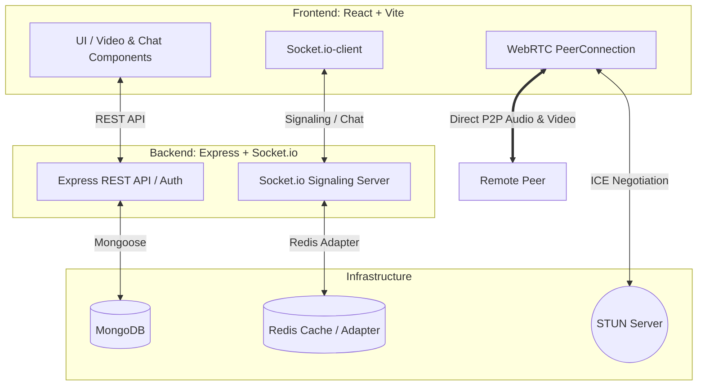

# Meetix 📹💬

Meetix is a dynamic, modern WebRTC-based platform designed for real-time video calls and instant messaging with random users worldwide. Leveraging peer-to-peer (P2P) connections, Meetix provides a seamless, low-latency communication experience directly within your web browser.

> [!WARNING]
> **Security & Privacy Note:** This application uses public **STUN servers** to facilitate WebRTC connection negotiation. STUN servers share your public IP address with the matching peer to establish a direct peer-to-peer media stream. For production environments, hosting and using **TURN servers** is highly recommended to relay traffic and fully mask client IP addresses.

---

## 🏗️ Architecture Overview

The system consists of a Vite-powered React frontend (client) and a Node.js/Express backend (server) serving as a REST API and a Socket.io signaling server. Redis handles cross-instance communication for WebSocket adapter scaling.



---

## ✨ Features

- **🎥 Live P2P Video Calls:** Ultra-low latency video and audio communication powered by the WebRTC API.
- **💬 Real-Time Chatting:** Integrated text messaging interface to chat alongside your video session.
- **🔄 Random Matchmaking:** Intelligent signaling flow that pairs active users automatically.
- **🔒 Secure Connections:** End-to-end media encryption (standard WebRTC security) and token-based REST authentication (JWT).
- **🎨 Modern Responsive UI:** Premium dark mode UI styled with TailwindCSS, featuring smooth hover states and transition animations.

---

## 🛠️ Tech Stack

### Frontend (Client)
- **Framework:** React 18 (Vite)
- **Styling:** TailwindCSS & PostCSS
- **Real-Time Client:** Socket.io-client
- **Icons:** Lucide React
- **Routing:** React Router DOM

### Backend (Server)
- **Runtime & Framework:** Node.js, Express 5 (Beta)
- **Real-Time Signaling:** Socket.io (with `@socket.io/redis-adapter` for scaling)
- **Database:** MongoDB (via Mongoose)
- **Caching & Lock Manager:** Redis (via ioredis and redlock)
- **Security:** bcryptjs, jsonwebtoken (JWT), express-rate-limit

---

## 🚀 Getting Started

### Prerequisites
Make sure you have the following installed on your local machine:
- **Node.js** (v18.0.0 or higher recommended)
- **npm** (v9.0.0 or higher)
- **MongoDB** (running locally or via MongoDB Atlas)
- **Redis** (running locally or via a cloud provider)

---

### Installation & Setup

#### 1. Clone the repository
```bash
git clone <repository-url>
cd meetix
```

#### 2. Configure the Backend Server
1. Navigate to the `server` directory:
   ```bash
   cd server
   ```
2. Install dependencies:
   ```bash
   npm install
   ```
3. Set up the environment variables:
   ```bash
   cp .env.sample .env
   ```
4. Open the `.env` file and adjust your database and connection settings.
5. Start the backend in development mode:
   ```bash
   npm run dev
   ```

#### 3. Configure the Frontend Client
1. Navigate to the `client` directory:
   ```bash
   cd ../client
   ```
2. Install dependencies:
   ```bash
   npm install
   ```
3. Set up the environment variables:
   ```bash
   cp .env.sample .env
   ```
4. Adjust values inside `.env` to point to your backend API and WebSocket endpoints:
   - `VITE_API_BASE_URL`: URL of the Express API (e.g., `http://localhost:8000/api/v1`)
   - `VITE_SOCKET_URL`: URL of the Socket.io Server (e.g., `http://localhost:8000`)
5. Start the frontend development server:
   ```bash
   npm run dev
   ```

---

## ⚙️ Environment Variables

### Server (`server/.env`)
| Variable | Description | Default / Example |
| :--- | :--- | :--- |
| `PORT` | The port the Express/Socket.io server listens on | `8000` |
| `NODE_ENV` | Running environment | `dev` |
| `MONGODB_URI` | Connection URI for the MongoDB database | `mongodb://localhost:27017/meetixdb` |
| `REDIS_URI` | Connection URI for the Redis server | `redis://localhost:6379` |
| `CORS_ORIGIN` | Allowed origin for Cross-Origin Resource Sharing | `http://localhost:5173` |
| `ACCESS_TOKEN_SECRET` | Secret key for signing Access JWTs | *Secure random string* |
| `ACCESS_TOKEN_EXPIRY` | Access token duration | `1d` |
| `REFRESH_TOKEN_SECRET`| Secret key for signing Refresh JWTs | *Secure random string* |
| `REFRESH_TOKEN_EXPIRY`| Refresh token duration | `10d` |
| `EMAIL_USER` | Email username for verification / mailers | `your_email@gmail.com` |
| `EMAIL_PASS` | App password for Gmail / mail server | `your_app_password` |
| `EMAIL_FROM` | From header for outgoing email | `Meetix <your_email@gmail.com>` |

### Client (`client/.env`)
| Variable | Description | Default / Example |
| :--- | :--- | :--- |
| `VITE_API_BASE_URL` | Base API endpoint for client fetch requests | `http://localhost:8000/api/v1` |
| `VITE_SOCKET_URL` | Signaling server WebSocket endpoint | `http://localhost:8000` |
| `VITE_GITHUB_PROFILE` | Link to the author's GitHub profile | `https://github.com/subhadipm08` |

---

## 🤝 Contributing

This project is currently in a maintenance-only state. Contributions are not actively accepted at this time.

---

## 📄 License

This project is open-sourced software licensed under the [MIT License](LICENSE) (or contact the owner for terms).

## ⚠️ Notes for Production Deployment
- **SSL/TLS (HTTPS & WSS):** WebRTC APIs require a secure context (HTTPS) to access webcams and microphones in browsers. Make sure your server is deployed behind an SSL-secured proxy (like Nginx, Cloudflare, or Caddy) and utilizes `wss://` for WebSockets.
- **TURN Server Deployment:** Set up a TURN server (e.g., Coturn) to route media for clients located behind symmetric NATs or strict firewalls.